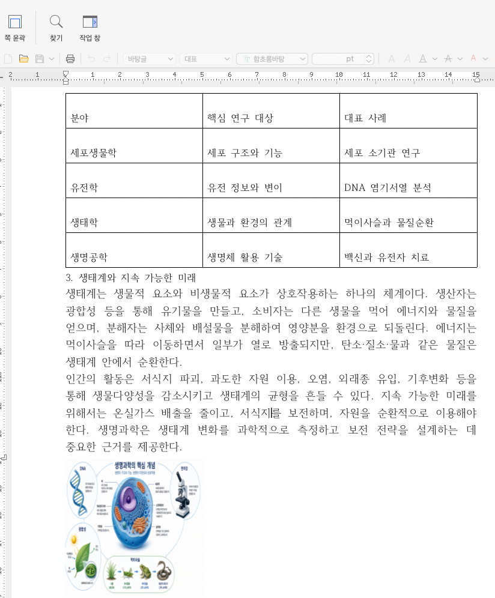

# hwpx-agent

**프롬프트를 통해 hwpx을 파일을 생성하고 수정하는 agent**

[](https://pypi.org/project/hwpx-agent/)
[](https://pypi.org/project/hwpx-agent/)
[](https://pypi.org/project/hwpx-agent/)

## 시작하기
```bash
pip install hwpx-agent
```

```python
import asyncio
import os
from hwpx import HwpxDocument
from hwpx_agent.hwpx_agent import HwpxAgent


os.environ["OPENAI_API_KEY"] = "sk-??"

async def main():
    agent = HwpxAgent(
        model="gpt-4.1-mini-2025-04-14",
    )

    hwpx_document: HwpxDocument = await agent.generate_template(
        prompt="생명과학 논문을 작성하고 싶은데 그거에 대한 초안을 작성해주고, 테이블로 이해하기 쉽도록 작성해줘",
        is_image_generate=True,
    )

    hwpx_document.save_to_path("life_science.hwpx")

if __name__ == "__main__":
    asyncio.run(main())
```

### 결과물 예시


### hwpx 파일 생성하기 (`generate_template`)
프롬프트를 바탕으로 새로운 HWPX 문서 초안을 생성합니다.

#### 시그니처 (Signature)
```python
from hwpx import HwpxDocument

async def generate_template(
        prompt: str,
        is_image_generate: bool = False,
) -> HwpxDocument:
    ...
```

#### 파라미터 (Parameters)

| 파라미터     | 타입     | 기본값    | 설명                                                |
|----------|--------|--------|---------------------------------------------------|
| `prompt` | `str`  | **필수** | 생성할 HWPX 문서의 내용, 구조, 구성 요소(표, 제목 등)에 대한 자연어 요청 사항 |
| `is_image_generate`     | `bool` | **선택** | 생성할 HWPX 문서에 AI를 통한 이미지 삽입의 여부                    |

#### 리턴 타입 (Return)

* **`HwpxDocument`**
생성된 HWPX 문서 객체를 반환합니다. 반환된 객체의 `.save_to_path("파일명.hwpx")` 메서드를 호출하여 파일로 저장할 수 있습니다.

#### 사용 예시 (Example)

```python
from hwpx import HwpxDocument

hwpx_document: HwpxDocument = await agent.generate_template(
    prompt="생명과학 논문 초안 및 요약 표 작성"
)
hwpx_document.save_to_path("output.hwpx")

```

#### 의존성
해당 라이브러리들을 사용 중입니다.

[python-hwpx](https://github.com/airmang/python-hwpx)

[openai-agents-python](https://github.com/openai/openai-agents-python)

[langgraph](https://github.com/langchain-ai/langgraph)